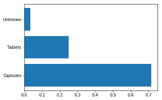
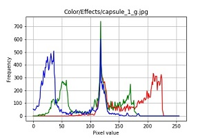
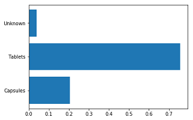
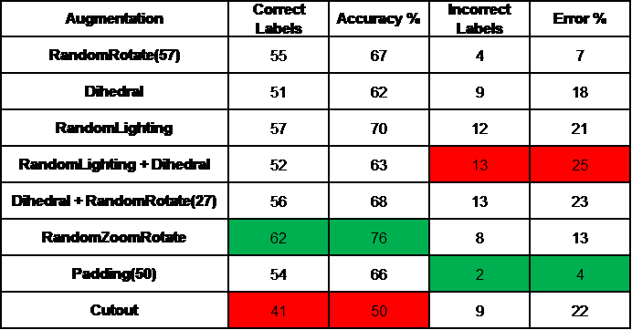
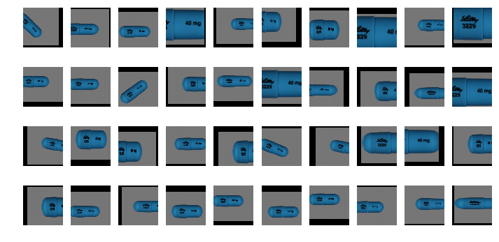

## Prescription Pill Recognition
Testing ground for improving medication recognition with minimal data

#### 1) Impact of image manipulation
Using pre-trained vgg-16 with Tensorflow. Training set of 40, Test set of 10 and Validation set of 10.

#### Test Image
 

#### Image manipulation included 4 different manipulation algorithms:
##### Original


##### Sharpen



##### Gaussian



##### Invert


##### Edges



### 2) Effect of different transformations on accuracy and error rate

 - Experimention done using transforms_playground.ipynb
 
 - The train set has 1040 images and the test set has 208 images
 - Training was done using Leslie Smith’s one cycle method
 - Training was done with a high learning rate, low cycle length, dedicating 5% of the cycle to annealing at the end with a maximum 
   momentum of 0.95 and a minimum momentum of 0.85 and a weight decay of 1e-5
 - There were a total number of 82 different labels that ranged from describing the shape, color, surface markings, strength; for  
   example a capsule could have the following labels [capsule], [blue], [TEVA], [multi color], [white], [capsule shape], [25mg] etc
 - The results were broken down into 1) N: The total number of correct labels predicted, 2) Accuracy: (N/82)*100 where 82 is the total
   number of labels, 3) E: The total number of incorrect labels predicted and 4) Error: (E/N)*100
   
#### Outcomes

The aim of this project was to find the highest accuracy with the lowest number of errors in the shortest amount of time (average training time per 10 epochs was around 3 minutes) we can see that by using various data augmentation techniques plus Leslie Smith’s one cycle approach we can get a good indication of what data augmentation techniques work best for this data set.



The summary of the results shows that [RandomZoomRotate] had the most correctly chosen labels and [Padding(50)] had the least number of incorrectly chosen labels. Vice versa [Cutout] had the least number of correctly chosen labels and [RandomLighting + Dihedral] had the highest number of incorrectly chosen numbers


What does a sample picture look like using a combination of RandomRotateZoom + AddPadding?



 For additional information you also refer to two articles I have written
 
 #### Data Augmentation Experimentation [Towards Data Science](https://towardsdatascience.com/data-augmentation-experimentation-3e274504f04b).
 
#### Data Augmentation Using Fastai [Becoming Human](https://becominghuman.ai/data-augmentation-using-fastai-aefa88ca03f1)

### PyTorch training script

The `src/train.py` script reproduces the augmentations explored above using
`torchvision.transforms`. You can control each augmentation from the command
line:

```
python src/train.py DATA_DIR \
    --rotation 20 --zoom 0.2 --brightness 0.1 --contrast 0.1 \
    --pad 50 --dihedral --cutout 0.4
```

This mirrors the `RandomZoomRotate`, `Padding`, `RandomLighting`+`Dihedral` and
`Cutout` experiments for easy comparison.

### Requirements

- Python 3 with `pip`
- [PyTorch](https://pytorch.org/) and `torchvision`

### Preparing the data

Place your pill images in a directory where each class has its own
subfolder. The structure should look like:

```
DATA_DIR/
    class_a/
        img1.jpg
        img2.jpg
    class_b/
        img3.jpg
        img4.jpg
```

### Example command

Run training for 10 epochs with a batch size of 32:

```
python src/train.py DATA_DIR --epochs 10 --batch-size 32
```

### Outputs

The script prints training progress to the console and writes model
checkpoints and metrics under the directory given by `--output`
(defaults to `outputs`).  `model_best.pth` is saved whenever validation
accuracy improves, while `model_final.pth` and both `metrics.csv` and
`metrics.json` are written at the end of training.


