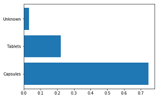

# PillView
Testing ground for improving medication recognition with minimal data

### 1) Impact of image manipulation
Using pre-trained vgg-16 with Tensorflow. Training set of 40, Test set of 10 and Validation set of 10.

#### Test Image
 

#### Image manipulation included 4 different manipulation algorithms:
##### Original

##### Sharpen

##### Gaussian

##### Invert

##### Edges

